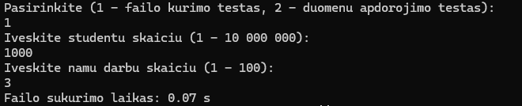
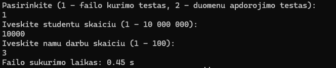
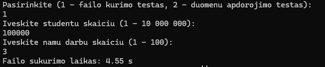
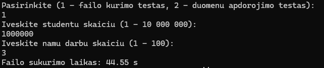
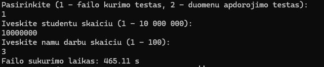
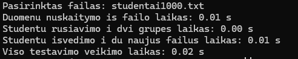
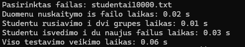
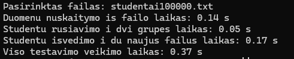
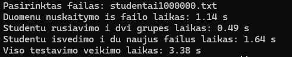
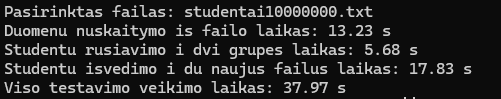

# V1.0
### Testavimo sistemos parametrai

**CPU:** Intel core i5-10210U
**SSD:** WDC PC SN520
**RAM:** 8GB

### Spartos testavimas su skirtingais konteineriais (3 ND)

**[std::vector]**

1000 studentu:\
duomenu nuskaitymas is failo - 0.004 s\
studentu rusiavimas didejimo tvarka - 0.005 s\
studentu skirstymas i dvi grupes - 0.002 s

10000 studentu:\
duomenu nuskaitymas is failo - 0.027 s\
studentu rusiavimas didejimo tvarka - 0.025 s\
studentu skirstymas i dvi grupes - 0.008 s

100000 studentu:\
duomenu nuskaitymas is failo - 0.148 s\
studentu rusiavimas didejimo tvarka - 0.345 s\
studentu skirstymas i dvi grupes - 0.064 s

1000000 studentu:\
duomenu nuskaitymas is failo - 1.181 s\
studentu rusiavimas didejimo tvarka - 4.096 s\
studentu skirstymas i dvi grupes - 0.616 s

10000000 studentu:\
duomenu nuskaitymas is failo - 15.721 s\
studentu rusiavimas didejimo tvarka - 55.102 s\
studentu skirstymas i dvi grupes - 9.542 s

**[std::list]**

1000 studentu:\
duomenu nuskaitymas is failo - 0.007 s\
studentu rusiavimas didejimo tvarka - 0.001 s\
studentu skirstymas i dvi grupes - 0.001 s

10000 studentu:\
duomenu nuskaitymas is failo - 0.030 s\
studentu rusiavimas didejimo tvarka - 0.005 s\
studentu skirstymas i dvi grupes - 0.005 s

100000 studentu:\
duomenu nuskaitymas is failo - 0.161 s\
studentu rusiavimas didejimo tvarka - 0.096 s\
studentu skirstymas i dvi grupes - 0.068 s

1000000 studentu:\
duomenu nuskaitymas is failo - 1.168 s\
studentu rusiavimas didejimo tvarka - 1.256 s\
studentu skirstymas i dvi grupes - 0.702 s

10000000 studentu:\
duomenu nuskaitymas is failo - 12.997 s\
studentu rusiavimas didejimo tvarka - 17.955 s\
studentu skirstymas i dvi grupes - 9.144 s

**[std::deque]**

1000 studentu:\
duomenu nuskaitymas is failo - 0.002 s\
studentu rusiavimas didejimo tvarka - 0.003 s\
studentu skirstymas i dvi grupes - 0.001 s

10000 studentu:\
duomenu nuskaitymas is failo - 0.014 s\
studentu rusiavimas didejimo tvarka - 0.032 s\
studentu skirstymas i dvi grupes - 0.003 s

100000 studentu:\
duomenu nuskaitymas is failo - 0.120 s\
studentu rusiavimas didejimo tvarka - 0.340 s\
studentu skirstymas i dvi grupes - 0.036 s

1000000 studentu:\
duomenu nuskaitymas is failo - 0.993 s\
studentu rusiavimas didejimo tvarka - 4.529 s\
studentu skirstymas i dvi grupes - 0.373 s

10000000 studentu:\
duomenu nuskaitymas is failo - 14.062 s\
studentu rusiavimas didejimo tvarka - 61.390 s\
studentu skirstymas i dvi grupes - 6.825 s

## V0.4
[1 TYRIMAS] Failo sukurimo vidurkiai (3 bandymai, 3 ND):

1000 studentu - 0.07 s 

10000 studentu - 0.44 s 

100000 studentu - 4.5 s 

1000000 studentu - 46 s 

10000000 studentu - 463 s 

[2 TYRIMAS] Duomenu apdorojimo vidurkiai (3 bandymai, 3 ND):

1000 studentu:
duomenu nuskaitymas is failo - 0.01 s
studentu rusiavimas i dvi grupes - 0.00 s
studentu isvedimas i du naujus failus - 0.01 s
viso testavimo veikimas - 0.02 s

10000 studentu:
duomenu nuskaitymas is failo - 0.03 s
studentu rusiavimas i dvi grupes - 0.01 s
studentu isvedimas i du naujus failus - 0.03 s
viso testavimo veikimas - 0.07 s

100000 studentu:
duomenu nuskaitymas is failo - 0.13 s
studentu rusiavimas i dvi grupes - 0.05 s
studentu isvedimas i du naujus failus - 0.16 s
viso testavimo veikimas - 0.36 s

1000000 studentu:
duomenu nuskaitymas is failo - 1.12 s
studentu rusiavimas i dvi grupes - 0.49 s
studentu isvedimas i du naujus failus - 1.60 s
viso testavimo veikimas - 3.34 s

10000000 studentu:
duomenu nuskaitymas is failo - 14.5 s
studentu rusiavimas i dvi grupes - 5.8 s
studentu isvedimas i du naujus failus - 19.15 s
viso testavimo veikimas - 39.45 s

## V0.2
Failu nuskaitymo vidurkiai (5 bandymai):

1. 'studentai.txt' - 0.00 s

2. 'studentai10000.txt' - 0.44 s

3. 'studentai100000.txt' - 1.99 s

4. 'studentai1000000.txt' - 16.52 s